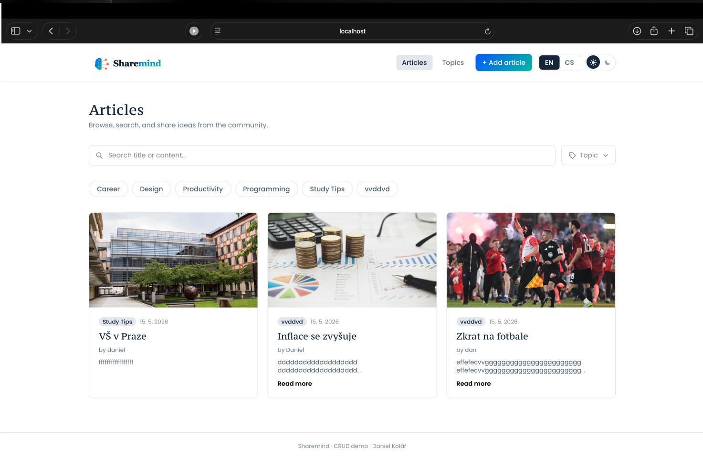
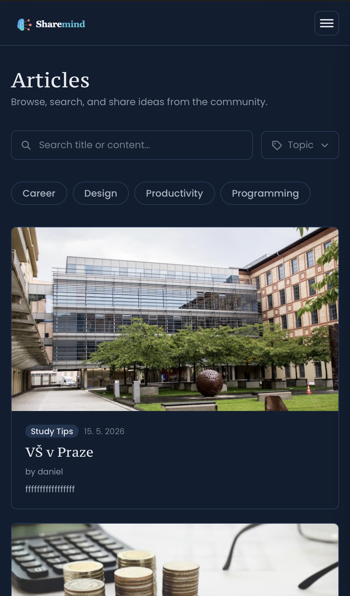

# ShareMind

A small full-stack CRUD demo for sharing articles organised by topics. Express + filesystem JSON storage on the backend, React + Vite + Tailwind on the frontend, with localisation (EN/CS), dark mode, and a mobile drawer.

## Screenshots

<p align="center">
  
  <br />
  <em>Light theme — desktop dashboard with filters and topic quick-pick row</em>
</p>

<p align="center">
  
  <br />
  <em>Dark theme — responsive mobile view</em>
</p>

## Stack

**Backend** (`server/`) — Node.js, Express, AJV validation, JSON-file storage.

**Frontend** (`web/`) — React 19, Vite, React Router, Tailwind v4, `react-i18next`.

## Features

- Articles & topics CRUD
- Search by title/content + multi-select topic filter with viewport-aware dropdown
- Quick-pick topic pills that auto-fit to the row width
- Animated language switcher (EN / CS) and theme toggle (light / dark)
- Dark-mode-aware logo
- Mobile hamburger + slide-in drawer
- Form validation (client-side) with i18n error messages

## Local development

```bash
# 1) Backend
cd server
npm install
node seed.js           # creates default topics on first run
npm run dev            # listens on http://localhost:8888

# 2) Frontend (new terminal)
cd web
npm install
npm run dev            # http://localhost:5173
```

The frontend defaults to `http://localhost:8888`. Override via `VITE_API_URL`.

## Project structure

```
.
├── server/
│   ├── app.js                # Express entry
│   ├── controller/           # route handlers
│   ├── abl/                  # application business logic
│   ├── dao/                  # JSON-file persistence
│   │   └── storage/          # articleList/*.json, topicList/*.json
│   └── seed.js
└── web/
    ├── src/
    │   ├── api/              # typed client
    │   ├── components/       # Layout, cards, filters, switchers
    │   ├── pages/            # Home, ArticleDetail, ArticleCreate, ...
    │   ├── i18n/             # locales/en.json, cs.json
    │   ├── hooks/useTheme.ts
    │   └── styles.css
    └── public/
        ├── sharemind-logo.svg
        └── sharemind-logo-dark.svg
```
